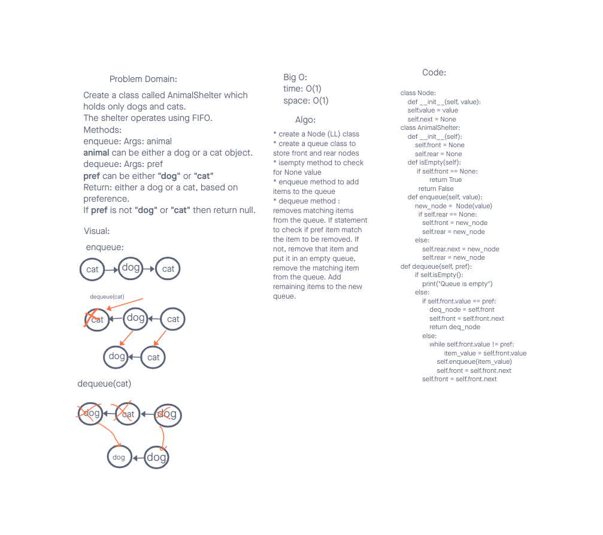

# Challenge Summary
<!-- Description of the challenge -->
Create a class called AnimalShelter which holds only dogs and cats.
The shelter operates using FIFO.
Methods:
enqueue: Args: animal
animal can be either a dog or a cat object.
dequeue: Args: pref
pref can be either "dog" or "cat"
Return: either a dog or a cat, based on preference.
If pref is not "dog" or "cat" then return null.

## Whiteboard Process
<!-- Embedded whiteboard image -->

## Approach & Efficiency
<!-- What approach did you take? Why? What is the Big O space/time for this approach? -->
Created a new class AnimalShelter and imported the Node class to utilize it on the code.
Created enqueue method to hanlde queueing of nodes.
Created dequeue method to handle the dequeueing. If the animal matches the front then return it
and if it doesn't then remove the items and enqueue them into a new queuet until you find the animal.
When found, return the animal and keep enqueueing so the queque doesn't lose its order.
Created isEmpty method to if the queque is empty.

Big O
time: O(1) all methods have time complexity of O(1) regardless of the number of nodes.
space: O(1) all methods have space complexity of O(1)

## Solution
<!-- Show how to run your code, and examples of it in action -->

