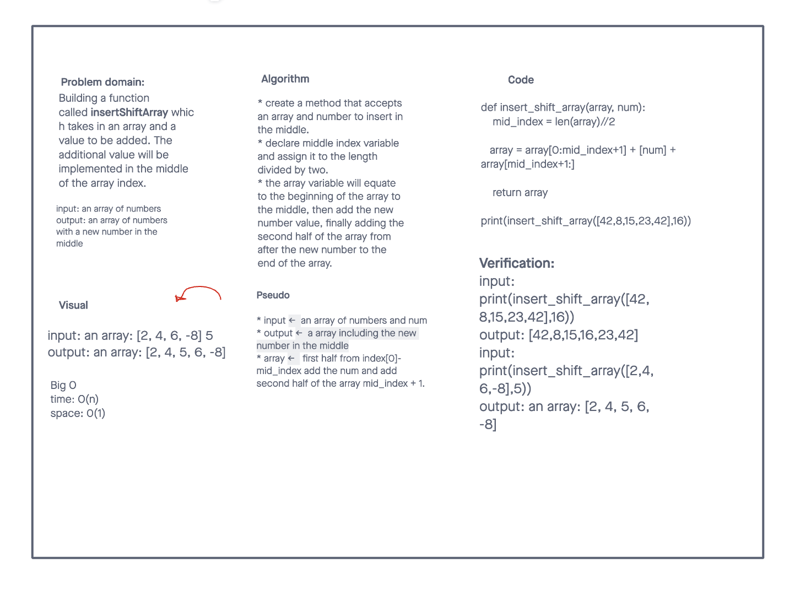

# array-insert-shift
<!-- Description of the challenge -->
Write a function called insertShiftArray which takes in an array and a value to be added. Without utilizing any of the built-in methods available to your language, return an array with the new value added at the middle index.

## Whiteboard Process
<!-- Embedded whiteboard image -->

## Approach & Efficiency
<!-- What approach did you take? Discuss Why. What is the Big O space/time for this approach? -->
We solved using the half lenth and iserting the number in mid. But we have to change it because insert is a built method. We tried to split the array and add half to a new array then append the new givev num and then add both arrays. We had some issues so I find some code in stackoverflow that inspired us to change to a more effecient.

https://stackoverflow.com/questions/48561673/adding-items-in-the-middle-of-a-list-in-python

