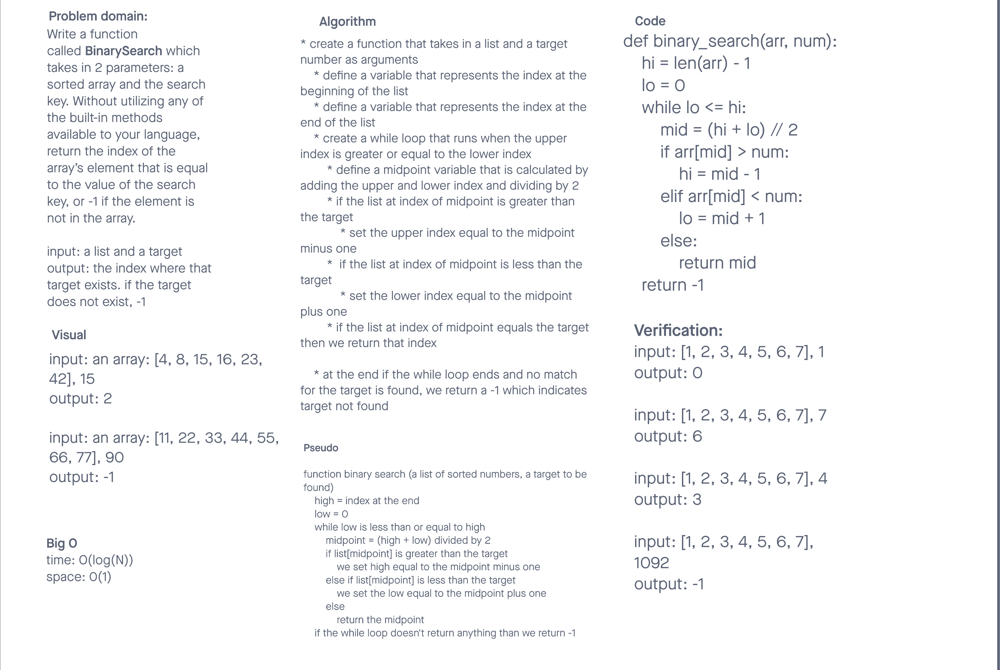

# array-insert-shift
<!-- Description of the challenge -->
Write a function called BinarySearch which takes in 2 parameters: a sorted array and the search key. Without utilizing any of the built-in methods available to your language, return the index of the array’s element that is equal to the value of the search key, or -1 if the element is not in the array.

## Whiteboard Process
<!-- Embedded whiteboard image -->

## Approach & Efficiency
<!-- What approach did you take? Discuss Why. What is the Big O space/time for this approach? -->
We solved problem using lower and higher and mid. Used a while loop to check and see if the the mid equals the the target value. If it doesn't we checked whether the value is on the right or left side. we eliminated half the array that doesn't contain the value until we either find the value or the target doesn't exist returning either a the index of the target or -1 in case it doesn't exist. We used this approach because it is time efficient and does the job in few steps.

The Big O:
time: O(log(N))
space: O(1)

