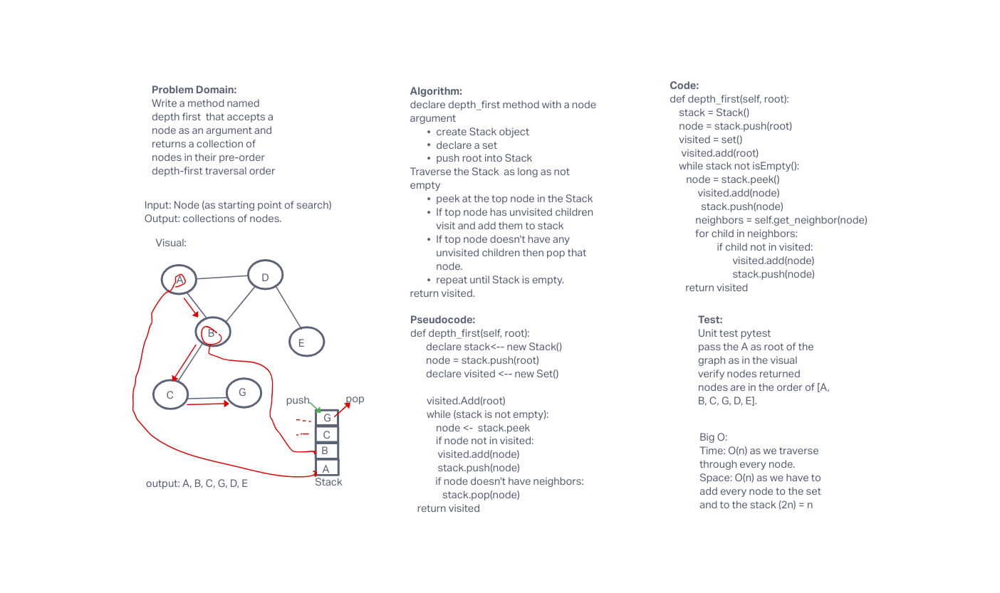

# Graph Depth First
<!-- Short summary or background information -->
Depth First is a way to traverse a collection of data. In a depth first traversal, we approach it a bit different than the way we do when working with a depth first traversal of a graph. Similar to how the breadth-first uses a queue, we are going to use a Stack for our depth-first traversal.

## Challenge
<!-- Description of the challenge -->

Write a method named depth first  that accepts a node as an argument and returns a collection of nodes in their pre-order depth-first traversal order

Input: Node (as starting point of search)
Output: collections of nodes.

## Approach & Efficiency
<!-- What approach did you take? Why? What is the Big O space/time for this approach? -->
declare depth_first method with a node argument

create Stack object
declare a set
push root into Stack
Traverse the Stack  as long as not empty

peek at the top node in the Stack
If top node has unvisited children visit and add them to stack
If top node doesn't have any unvisited children then pop that node.
repeat until Stack is empty.
return visited.

Big O:

Time: O(n) as we traverse through every node.

Space: O(n) as we have to add every node to the set and to the stack (2n) = n

## API
<!-- Description of each method publicly available in your Graph -->
