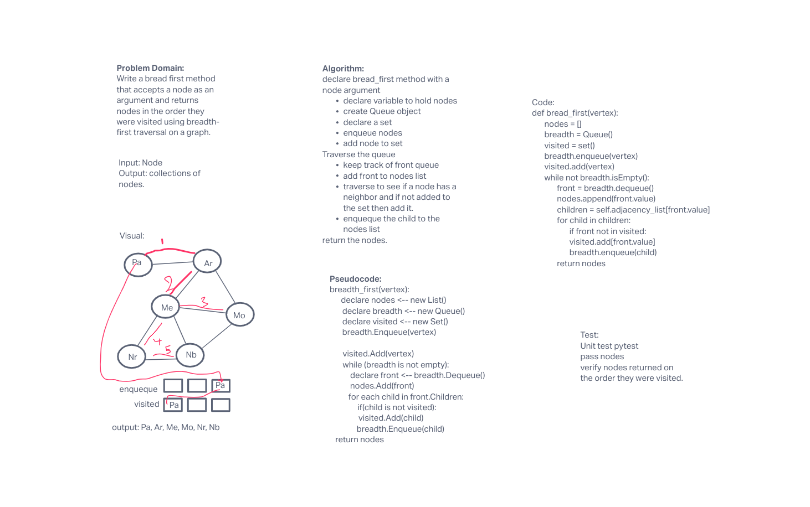

# Graph Breadth First
<!-- Short summary or background information -->
A graph is a non-linear data structure that can be looked at as a collection of vertices (or nodes) potentially connected by line segments named edges.

## Challenge
<!-- Description of the challenge -->

Write a bread first method that accepts a node as an argument and returns nodes in the order they were visited using breadth-first traversal on a graph.
Input: a node
Output: a collection of nodes

## Approach & Efficiency
<!-- What approach did you take? Why? What is the Big O space/time for this approach? -->

## API
<!-- Description of each method publicly available in your Graph -->
