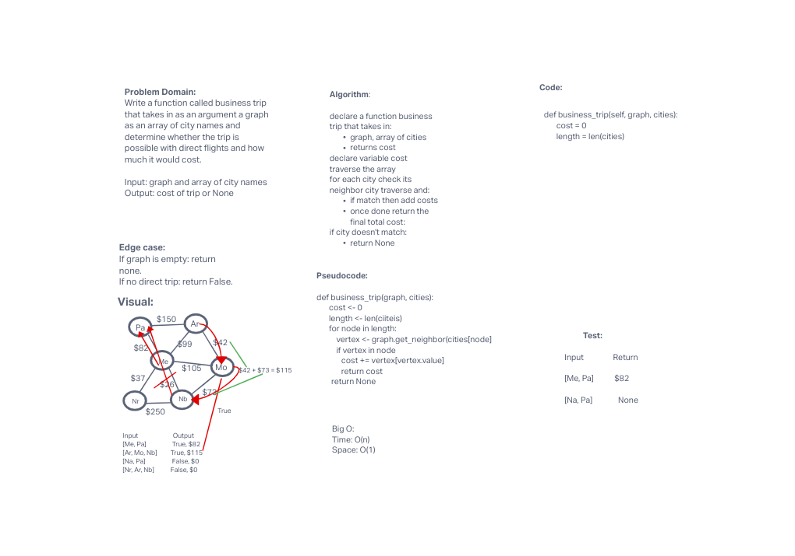

# Graph
<!-- Short summary or background information -->
A graph is a non-linear data structure that can be looked at as a collection of vertices (or nodes) potentially connected by line segments named edges.

## Challenge
<!-- Description of the challenge -->
Write a function called business trip that takes in an argument of a graph/array of city names and determine whether the trip is possible with direct flights and how much it would cost.

Input: graph and array of city names
Output: cost of trip or None

## Approach & Efficiency
<!-- What approach did you take? Why? What is the Big O space/time for this approach? -->
declare a function business trip that takes in:

graph, array of cities
returns cost
declare variable cost

traverse the array

for each city check its neighbor city traverse and:

if match then add costs
once done return the final total cost:
if city doesn't match:

return None

Big O:
Time: O(n)
Space: O(1)

## API
<!-- Description of each method publicly available in your Graph -->
