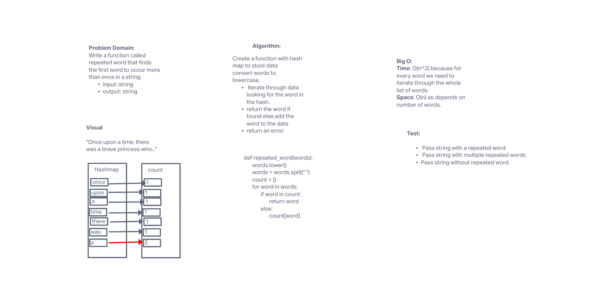

# Challenge
<!-- Short summary or background information -->
Find the first repeated word of string argument that is passed to a function.

## Approach & Efficiency
<!-- What approach did you take? Why? What is the Big O space/time for this approach? -->
Convert string to lowercase. convert string to a list.
Store words in hashmap. Loop through checking for the word.
If word is already there return the word else add the word to the hash.

Generally speaking the Big O is:
Time complexity: O(n^2)
Space complexity: O(n)

## API
<!-- Description of each method publicly available in each of your hashtable -->
