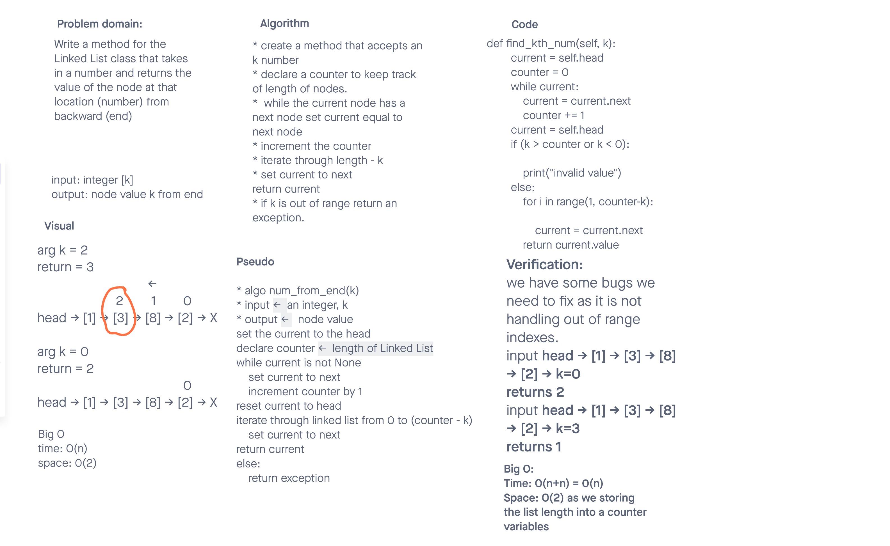

# Challenge Summary
<!-- Description of the challenge -->
Feature Tasks
Write the following method for the Linked List class:
kth from end
argument: a number, k, as a parameter.
Return the node’s value that is k places from the tail of the linked list.
You have access to the Node class and all the properties on the Linked List class as well as the methods created in previous challenges.

## Whiteboard Process
<!-- Embedded whiteboard image -->

## Approach & Efficiency
<!-- What approach did you take? Why? What is the Big O space/time for this approach? -->
We created a counter to keep track of the length of the nodes. traversed the linked list as long as there are nodes in it while incrementing the counter.
Had a for to go through the nodes in the range of length minus the k.
Either return the node value if found or an error message.a

Big O
time: O(n) two loops which are O(n+n), but it can be simplified to O(n)
space: O(2) as we had the countrer stores as many nodes as there are.

## Solution
<!-- Show how to run your code, and examples of it in action -->
