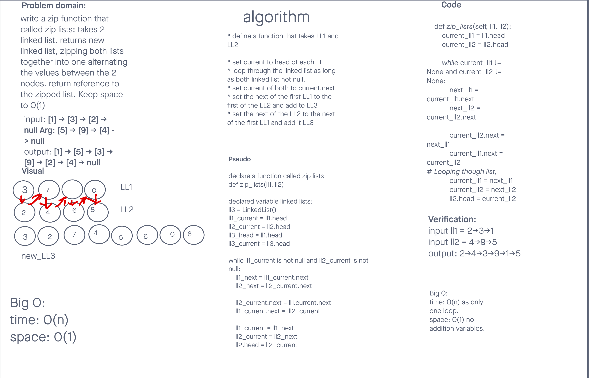

# Challenge Summary
<!-- Description of the challenge -->
Write a function called zip lists
Arguments: 2 linked lists
Return: New Linked List, zipped as noted below
Zip the two linked lists together into one so that the nodes alternate between the two lists and return a reference to the the zipped list.
Try and keep additional space down to O(1)
You have access to the Node class and all the properties on the Linked List class as well as the methods created in previous challenges.

## Whiteboard Process
<!-- Embedded whiteboard image -->

## Approach & Efficiency
<!-- What approach did you take? Why? What is the Big O space/time for this approach? -->
Just set the two linked lists current nodes to the particular heads.
Traversed the LL as long as there is a Node. Created variables to save the next values of the nodes.
Then swaped the second ll next node with first ll next node.
Adjust our nodes to next nodes.

Big O
time: O(n) traversed the linked list just once.
space: O() as there is no additional space or variables were used.

## Solution
<!-- Show how to run your code, and examples of it in action -->
