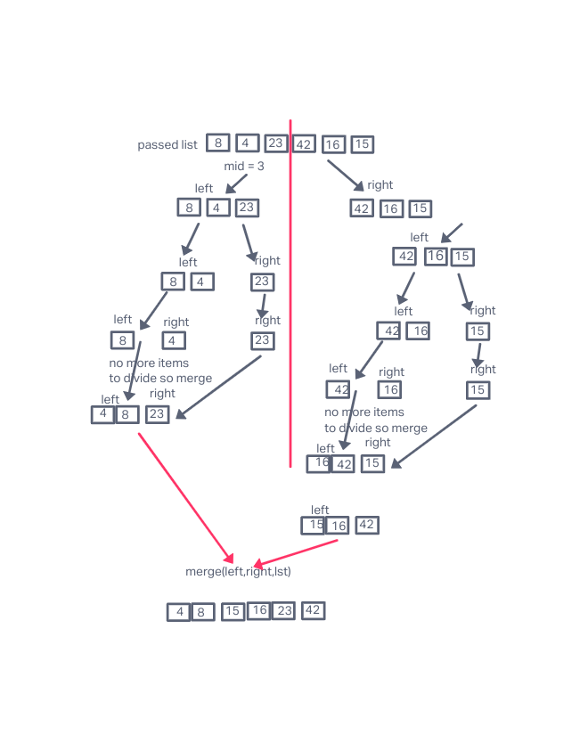

# Merge Sort
In this article I will show how the Insertion Sort algorithm works. I will pass the algorithm the list of unsorted list [8,4,23,42,16,15] and show visually how the algorithms works with each iteration.

The Insertion Sort according to Wikipedia "Insertion sort is a simple sorting algorithm that builds the final sorted array one item at a time. It is much less efficient on large lists than more advanced algorithms such as quicksort, heapsort, or merge sort"

## Pseudocode
```
 ALGORITHM Mergesort(arr)
    DECLARE n <-- arr.length

    if n > 1
      DECLARE mid <-- n/2
      DECLARE left <-- arr[0...mid]
      DECLARE right <-- arr[mid...n]
      // sort the left side
      Mergesort(left)
      // sort the right side
      Mergesort(right)
      // merge the sorted left and right sides together
      Merge(left, right, arr)

ALGORITHM Merge(left, right, arr)
    DECLARE i <-- 0
    DECLARE j <-- 0
    DECLARE k <-- 0

    while i < left.length && j < right.length
        if left[i] <= right[j]
            arr[k] <-- left[i]
            i <-- i + 1
        else
            arr[k] <-- right[j]
            j <-- j + 1

        k <-- k + 1

    if i = left.length
       set remaining entries in arr to remaining values in right
    else
       set remaining entries in arr to remaining values in left

```

## Tracing
Sample input: [8,4,23,42,16,15]
Using the pseudocode above let's step into our mergesort function:
* We declare a variable n to hold the length of the array/list
* As long as the n (length of the array) is greater than 1
* We declare a variable mid to hold the mid point (index) of the array/list by dividing the n by 2
* We declare a variable left to hold the low/left half of the array/list
* We declare a variable right to hold the high/right half of the array/list
Our recursive function keeps finding mid index and left and right parts of the list until the length(n) condition is false.
* after splitting is we sort the left, right side by calling our recursive function `Mergesort(left)` and `Mergesort(right)` then we call our merge function to sort both sides `Merge(left, right, arr)`

Inside the while loop compare left and right and and place the smallest value to the left.
At the end we merge our left and right halves together.


# Visual


# Big O
* Time: O(nlogn) as we have a recursive functions and a loop
* Space: O(n) as we are not using addition spaces.
