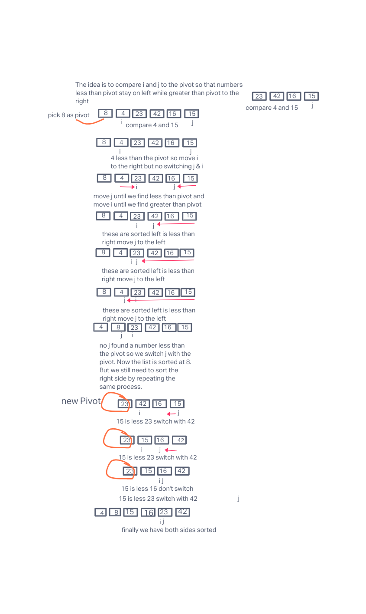

# Quick Sort

Quick Sort works by picking a pivot (number from the array/list) let's say the most left number. Then it assigns two variables to keep track of numbers less than the pivot (j) and numbers greater than or equal to the pivot (i). The numbers are sorted by putting the greater numbers on the right and the less than to the left of the list and the pivot ends up where it belongs say in the middle where all numbers to its left is less and to its right are greater( now the pivot is sorted and will not move). And finally we sort both the left and the right using the same method and picking a pivot for the left side and a pivot for the right side.

In this article I will show how the Quick Sort algorithm works. I will pass the algorithm the list of unsorted list [8,4,23,42,16,15] and show visually how the algorithms works with each iteration.

## Pseudocode

```
ALGORITHM QuickSort(arr, left, right)
    if left < right
        // Partition the array by setting the position of the pivot value
        DEFINE position <-- Partition(arr, left, right)
        // Sort the left
        QuickSort(arr, left, position - 1)
        // Sort the right
        QuickSort(arr, position + 1, right)

ALGORITHM Partition(arr, left, right)
    // set a pivot value as a point of reference
    DEFINE pivot <-- arr[right]
    // create a variable to track the largest index of numbers lower than the defined pivot
    DEFINE low <-- left - 1
    for i <- left to right do
        if arr[i] <= pivot
            low++
            Swap(arr, i, low)

     // place the value of the pivot location in the middle.
     // all numbers smaller than the pivot are on the left, larger on the right.
     Swap(arr, right, low + 1)
    // return the pivot index point
     return low + 1

ALGORITHM Swap(arr, i, low)
    DEFINE temp;
    temp <-- arr[i]
    arr[i] <-- arr[low]
    arr[low] <-- temp
```

## Tracing

Sample input: [8,4,23,42,16,15]
* We start by picking up a 8 as a pivot.
* We declare a variable i to keep look for numbers greater than or equal to the pivot.
* We declare j to look for numbers that are less than the pivot starting at the most right position.
* If we find those numbers we switch them until our pivot finds its right sorted position.
* Finally we sort both the left and right sides of the pivot using the same process by picking a new pivot for each side.
# Visual



# Big O

* Time: O(n^2) as we have a recursive functions and a loop
* Space: O(logn) as we are not using addition spaces.
