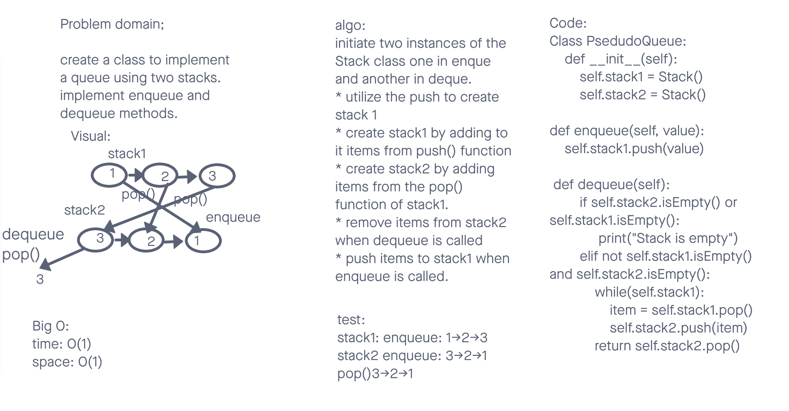

# Challenge Summary
<!-- Description of the challenge -->
Create a new class called pseudo queue.
Do not use an existing Queue.
Instead, this PseudoQueue class will implement our standard queue interface (the two methods listed below),
Internally, utilize 2 Stack instances to create and manage the queue
Methods:
enqueue
Arguments: value
Inserts value into the PseudoQueue, using a first-in, first-out approach.
dequeue
Arguments: none
Extracts a value from the PseudoQueue, using a first-in, first-out approach.h

## Whiteboard Process
<!-- Embedded whiteboard image -->

## Approach & Efficiency
<!-- What approach did you take? Why? What is the Big O space/time for this approach? -->
Created a new class and imported the Stack class to utilize the push and pop methods etc.
Created created 2 instances of the Stack class.
To enqueue pushed values into the first stack
To dequeue values first used the pop method return values to push them into the second stack.
When dequeue called the pop method into the second stack.

Big O
time: O(1) all methods have time complexity of O(1) regardless of the number of nodes.
space: O(1) all methods have space complexity of O(1)

## Solution
<!-- Show how to run your code, and examples of it in action -->

