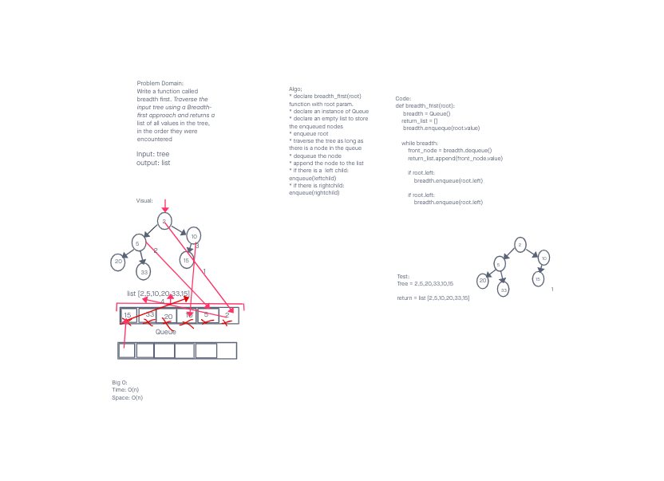

# Challenge Summary
<!-- Description of the challenge -->
Write a function called breadth first. Traverse the input tree using a Breadth-first approach and returns a list of all values in the tree, in the order they were encountered

## Whiteboard Process
<!-- Embedded whiteboard image -->

## Approach & Efficiency
<!-- What approach did you take? Why? What is the Big O space/time for this approach? -->
Algo;

* declare breadth_first(root) function with root param.

* declare an instance of Queue

* declare an empty list to store the enqueued nodes

* enqueue root

* traverse the tree as long as there is a node in the queue

* dequeue the node

* append the node to the list

* if there is a  left child:

enqueue(leftchild)

* if there is rightchild:

enqueue(rightchild)
Big O
time: O(n) visiting all nodes using a while loop.
space: O(n) every node is added to a list.

## Solution
<!-- Show how to run your code, and examples of it in action -->
