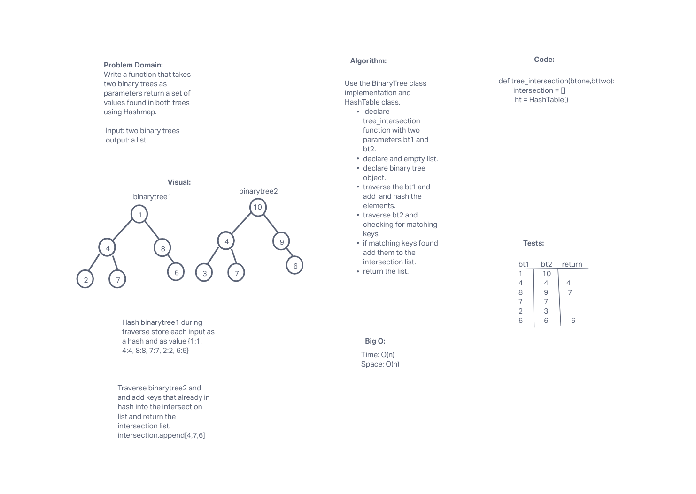

# Challenge
<!-- Short summary or background information -->
Write a function that takes two binary trees as parameters return a set of values found in both trees using Hashmap.

## Approach & Efficiency
<!-- What approach did you take? Why? What is the Big O space/time for this approach? -->
Store one binary tree as a hashmap. Then try to hash the second tree to the first hash and if key already exists add it to a list.
At the end return the list of values that were found in both binary trees.

Generally speaking the Big O is:
Time complexity: O(n)
Space complexity: O(n)

## API
<!-- Description of each method publicly available in each of your hashtable -->
