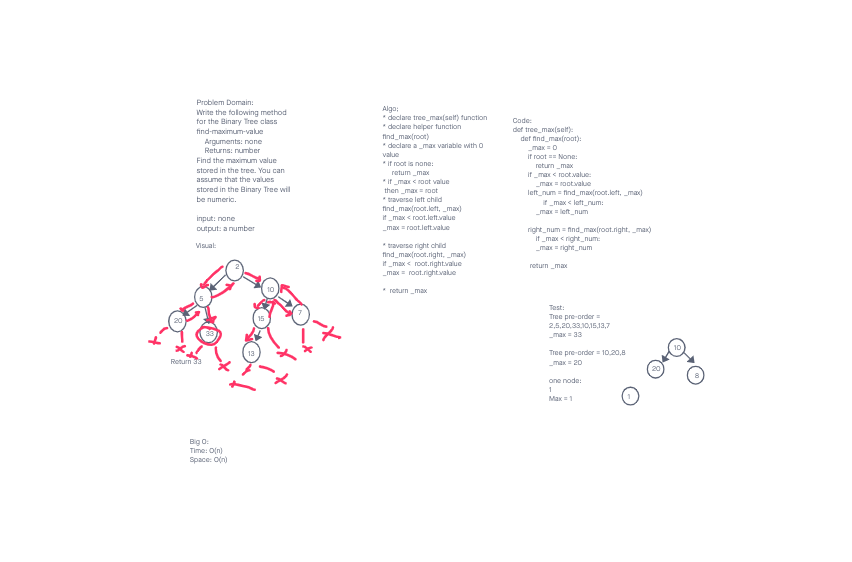

# Challenge Summary
<!-- Description of the challenge -->
Problem Domain:
Write the following method for the Binary Tree class

find-maximum-value:
 Arguments: none
 Returns: number

Find the maximum value stored in the tree. You can assume that the values stored in the Binary Tree will be numeric.

## Whiteboard Process
<!-- Embedded whiteboard image -->

## Approach & Efficiency
<!-- What approach did you take? Why? What is the Big O space/time for this approach? -->
* declare tree_max(self) function

* declare helper function find_max(root)

* declare a _max variable with 0 value

* if root is none:

  return _max

* if _max < root value

 then _max = root

* traverse left child find_max(root.left, _max)

if _max < root.left.value
_max = root.left.value
* traverse right child find_max(root.right, _max)
if _max <  root.right.value
_max =  root.right.value
* return _max
Big O
time: O(n) as our tree is not search binary tree
space: O(n) as we have to make recursive calls everytime.

## Solution
<!-- Show how to run your code, and examples of it in action -->
